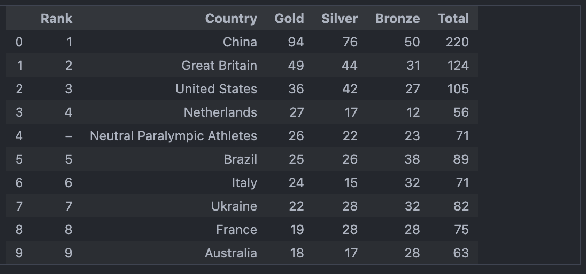
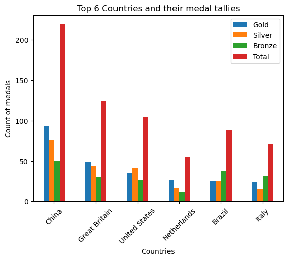
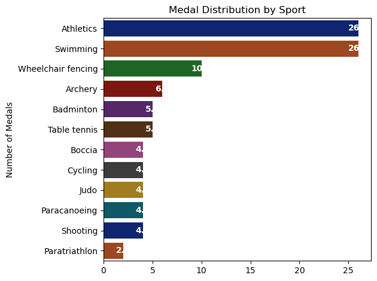

# Overview 
Welcome to my analysis of the Paralympics 2024. I found this dataset on Kaggle official website and this was interesting to me to work on. It helps me to strengthen my Python skills on my Data Analysis career. 

Paralympics 2024 was held from 28 Aug 2024 - 8 Sept 2024 and there were about 549 events in 22 different sports sector. This analysis explores key data about total medal wins by each country and medal distribution in each sport. 

# Tools I used
 For this analysis project, I used several key tools:
- Python: This is the backbone of my analysis which helped me with overall project operations. I have used following Python libraries:

    - Pandas library: This was used to analyze data.
    - Matplotlib library: I visualized the data.
    -Seaborn Library: Helped me create more advanced visuals.

- Jupyter Notebooks: The tool I used to run my python scripts which let me easily include my notes and analysis.

- Visual Studio Code: My go-to for executing my Python scripts.
- Git and GitHub: Essential for version control and sharing my Python code and analysis, ensuring collaboration and initialization. 


# The Analysis
 ## Top 10 medal-winning countries
 ```Python
    df_medal_table.head(10) 
```



### Insights
- Throughout the tournament, we can see that China leads by a significant margin, securing 220 medals in total. This is almost twice of the second-ranked country, Great Britian, which has 124 medals.

- The 5th to 9th ranked countries, like Brazil, Italy, Ukraine, France, and Australia, have a relatively narrow range of total medals(between 63 and 89), suggesting a competitive balance among these nations.

## Top 6 Countries in Bar Graph view
```Python
import matplotlib.ticker as mticker
df_medal_table = df_medal_table.drop(index= 4)
df_medal_table = df_medal_table.set_index(['Country'])
df_medal_table.head(6).plot(kind='bar')
plt.title('Top 6 Countries and their medal tallies')
plt.xlabel('Countries')
plt.ylabel('Count of medals')
plt.xticks(rotation = 45)
plt.show()
```



## Top 10 Sports with most medal distributions
```Python
df_plot = df_medal_winners['Sport'].value_counts()
bar_plot = sns.barplot(y = df_plot.index, x = df_plot.values, palette= 'dark', hue= df_plot.index, legend= False)

plt.title("Medal Distribution by Sport")
plt.ylabel('Number of Medals')

# Adding value labels to bars
for p in bar_plot.patches:
    bar_plot.annotate(f'{p.get_width()}', (p.get_width(), p.get_y() + p.get_height()/2),
                      ha = 'center', va = 'center', color = 'white', fontsize = 10, weight = 'bold')
plt.tight_layout()
plt.show()
```



### Insights 
- We can see that Atheltics and Swimming are the standout sports, each contributing 26 medals. This possibly indicates that the Paralympians are given specialized training for these events. 

- WHeelchair Fencing holds a strong third position with 10 medals, to my surprise. This suggests a higher level of specialization of success in this niche sport compared to others.

- After top 3, the distribution of medals is relatively even across other sports. This could be a topic of research as to why these sports are given less focus or why less athletes show up for these events.

# Conclusion
 This analysis of Paralympics 2024 has been incredibly informative, highlighting the major events and participants across the globe. The insights I got enhance my understanding and provide actionable guidance for anyone looking to advance their career in data analytics. As the years go by, the data will also change, and I believe paralympics will see a different horizon. This project is a good foundation for future projects and it helps build the importance of continuous learning and adaption in the data field.

